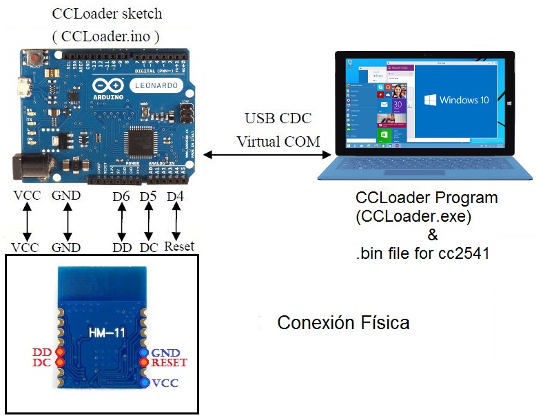

# Cargar-CCLoader-en-el-CC254X

Pasos para grabar el firmware CC254x con una placa Arduino.
1.	Cargar el sketch CCLoader.ino en la placa Arduino.
2.	Conectar los pines:

3.	Ejecutar y usar CCLoader.exe para cargar Demo.bin en la placa Arduino y la placa grabará el firmware en el microcontrolador del módulo de Bluetooth.
